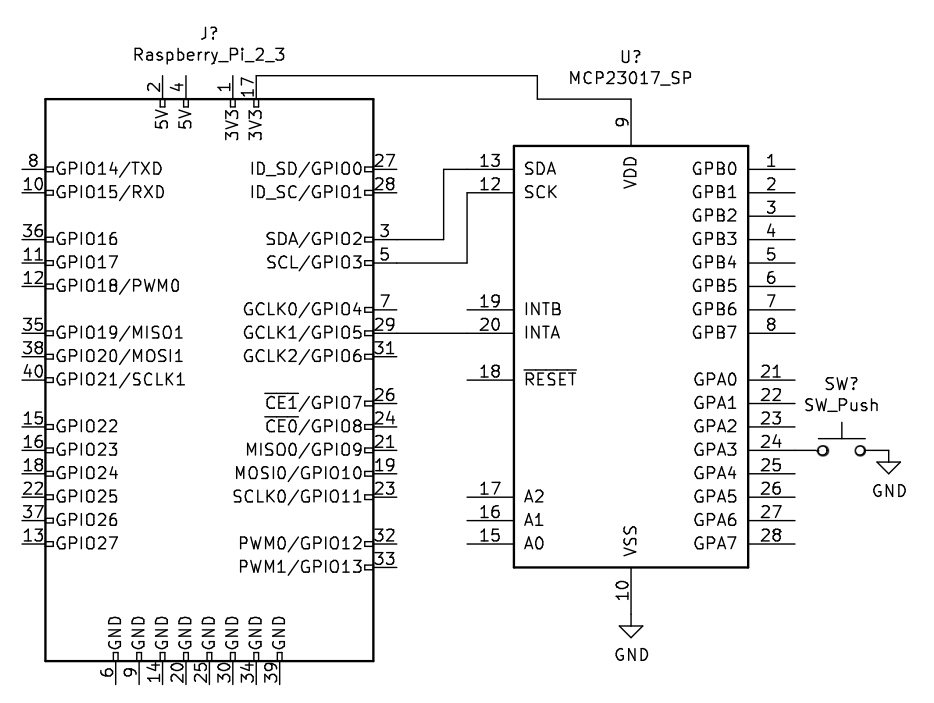
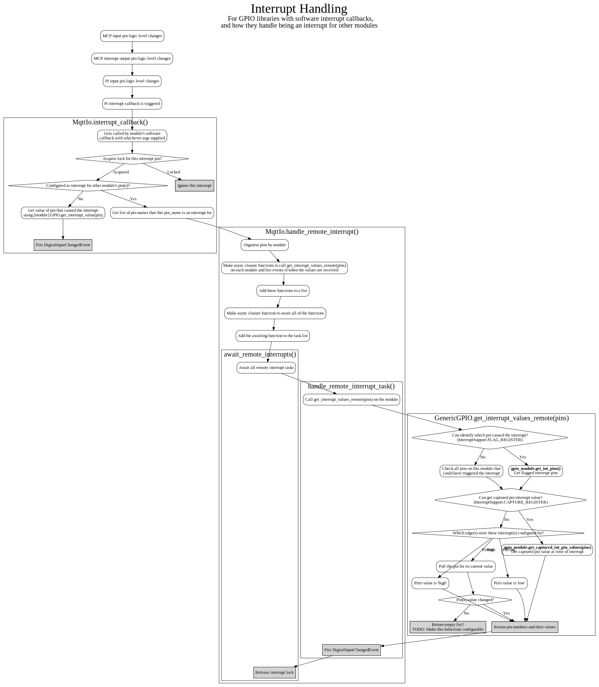

# Interrupts

Repeatedly checking the value of all of the GPIO inputs we're configured with is a lot of work and can miss level changes if they change back before we poll the pin again. Interrupts exist for this reason. They invert the process, which is to say that the lower level code (C library/kernel etc.) calls the higher level code (MQTT IO's Python code) when an input changes level. This has the benefit of not wasting CPU cycles on polling, as well as being much more responsive to input level changes.

## Implementation

The way that interrupts are exposed and supported by different hardware modules and software libraries can vary greatly.

Sometimes the interrupts are available as software callbacks on the hardware's Python library. Sometimes the hardware will have registers that store which pin triggered the interrupt and what value it had. Sometimes the hardware will simply change the logic level on a dedicated pin to indicate that one of its inputs changed.

MQTT IO attempts to accommodate these various configurations as best it can.

Sometimes, like with the Raspberry Pi, this means that we get an interrupt on a pin, our Python callback function is called, but we still have to poll the pin for its current value (this only applies when the interrupt is configured to fire on both rising AND falling edges, as we can infer the value when it only triggers on a rising OR falling edge.)

Other times, like with the MCP23017, we get no information from the software library that an interrupt has occurred, but by connecting its interrupt output pin to a Raspberry Pi input pin, we can use the software callback to trigger a read of the MCP23017's registers that specify which pin changed, and what value it got set to.

## Example

This is an example configuration using the Raspberry Pi and MCP23017 IO expander chip in which (as above) one of the MCP's interrupt output pins is connected to an input on the Raspberry Pi and the software is configured to listen on the Raspberry Pi pin's interrupt to then get the interrupt pin and value from the MCP.

The following steps occur when the button in the diagram is pushed:

1. `SW_Push` button is pushed, pulling the MCP's `GPA3` low
2. The MCP pulls its interrupt pin `INTA` low
3. The Raspberry Pi input pin `GPIO5` is pulled low and triggers an interrupt
4. The Raspberry Pi's GPIO library calls MQTT IO's callback
5. MQTT IO checks the `mcp23017` module's interrupt support and uses the `get_int_pins()` and `get_captured_int_pin_values()` methods to figure out which pin triggered the interrupt and what logic level it changed to
6. MQTT IO publishes the value of the pin that changed (`GPA3`) to the `<topic_prefix>/input/mcp3` MQTT topic

### Connection Diagram



### Configuration

This is configured by adding the `interrupt_for` section to a `digital_inputs` entry in the config file:

```yaml
gpio_modules:
  - name: rpi
    module: raspberrypi

  - name: mcp
    module: mcp23017

digital_inputs:
  - name: pi5
    module: rpi
    pin: 5
    interrupt: falling
    interrupt_for:
      - mcp3

  - name: mcp3
    module: mcp23017
    pin: 3
    interrupt: both
```

## Module Support

It's up to each GPIO module to specify which interrupt features are supported by setting flags on its `INTERRUPT_SUPPORT` constant, as well as implement the methods to support them:

```python
from . import GenericGPIO, InterruptSupport

class GPIO(GenericGPIO):
    """
    Implementation of GPIO class for the MCP23017 IO expander chip.
    Pin numbers 0 - 15.
    """

    INTERRUPT_SUPPORT = (
        InterruptSupport.FLAG_REGISTER
        | InterruptSupport.CAPTURE_REGISTER
        | InterruptSupport.INTERRUPT_PIN
        | InterruptSupport.SET_TRIGGERS
    )

    def get_int_pins(self):
        """
        Read the register and return a list of pins that triggered the interrupt.
        """
        return self.io.int_flag

    def get_captured_int_pin_values(self, pins=None):
        """
        Read the register that logs the values of the pins at the point of
        the last interrupt, and return a dict.

        If pins is None, then we get the whole register and return it, otherwise
        just return the values for the pins requested.
        """
        values = self.io.int_cap
        if pins is None:
            pins = range(16)
        pin_values = {}
        for pin in pins:
            pin_values[pin] = values[pin]
        return pin_values

    ...
```

This way, when an interrupt pin (for example on Raspberry Pi) is configured as an `interrupt_for` a pin on this module, the `GenericGPIO.get_interrupt_values_remote()` method will use the functions available to establish which pins were changed and what their values were.

If the hardware doesn't support these features, then `GenericGPIO.get_interrupt_values_remote()` will just fall back to polling the pin(s) and returning those values instead.

## Flow Chart

The following is the somewhat complex flow of internal logic that describes the behaviour of the interrupt system.

